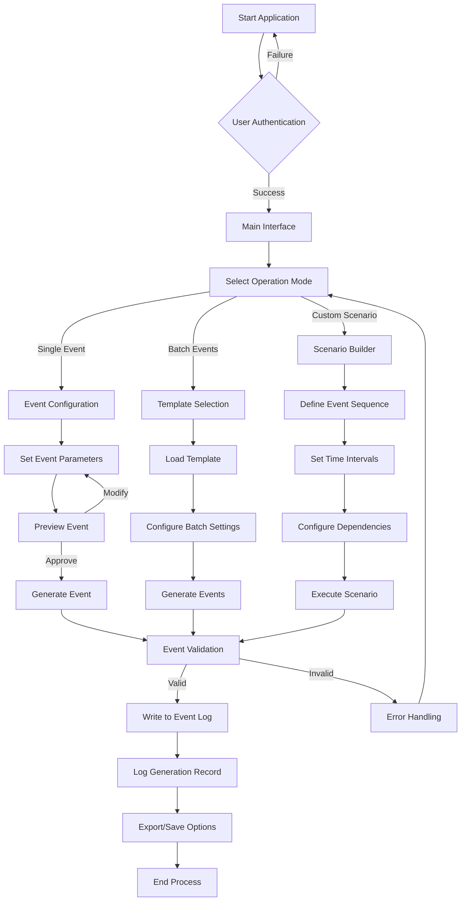
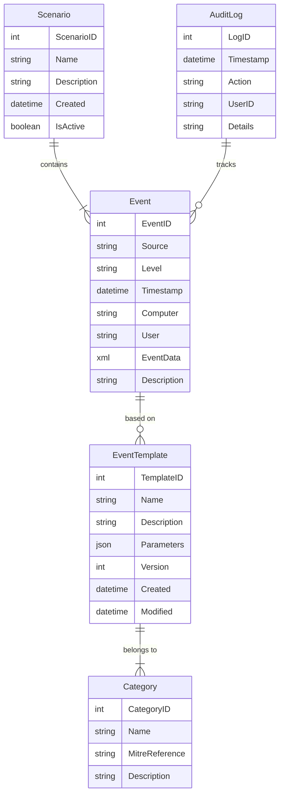
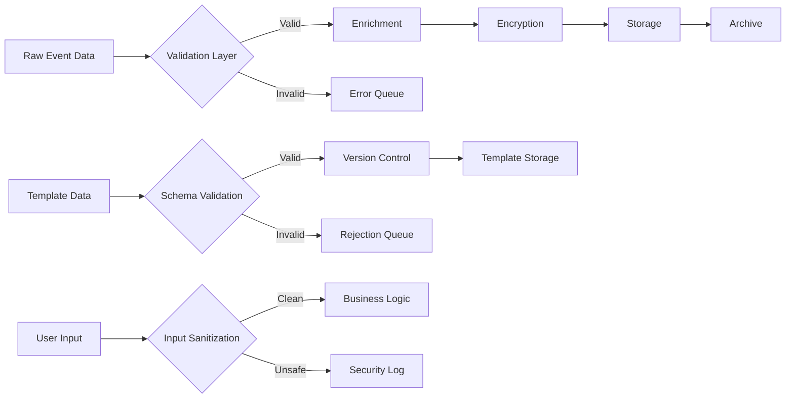

# Product Requirements Document (PRD)

# 1. INTRODUCTION

## 1.1 Purpose
This Product Requirements Document (PRD) specifies the requirements for a Windows Event Simulator tool designed for security testing and training purposes. The document serves as a comprehensive guide for developers, security engineers, QA teams, and stakeholders involved in the development and implementation of the tool.

## 1.2 Scope
The Windows Event Simulator is a specialized software tool that generates synthetic Windows Event Log entries mimicking real-world security vulnerabilities and system behaviors. The system will:

- Create simulated Windows Events that mirror actual security incidents
- Generate events across various Windows Event Log categories (Security, System, Application)
- Produce events with configurable parameters matching known vulnerability patterns
- Support both individual event creation and batch simulation scenarios
- Maintain consistency with standard Windows Event Log formats and structures
- Enable security professionals to test detection mechanisms and response procedures
- Provide a controlled environment for security training and system validation

The tool's primary focus is on security-related events, particularly those associated with common vulnerabilities, privilege escalation attempts, and system compromises. It does not modify actual system events or interfere with existing Windows Event logging mechanisms.

# 2. PRODUCT DESCRIPTION

## 2.1 Product Perspective
The Windows Event Simulator operates as a standalone application within the Windows operating system environment. It interfaces with the Windows Event Log architecture but maintains isolation from the actual event logging system to prevent interference with genuine system events. The tool functions as part of the broader security testing ecosystem, complementing existing security information and event management (SIEM) systems, intrusion detection systems (IDS), and security monitoring tools.

## 2.2 Product Functions
- Event Generation
  - Create synthetic Windows Event Log entries across Security, System, and Application logs
  - Support both single event and bulk event generation
  - Configure event parameters including Event ID, Source, Level, and custom fields
  - Generate events based on predefined vulnerability templates
  - Support temporal event sequencing and correlation

- Event Management
  - Save and load event generation configurations
  - Export generated events in standard Windows Event Log formats
  - Schedule automated event generation scenarios
  - Maintain an audit trail of generated events

- Template Management
  - Create and modify event templates
  - Import templates from existing event logs
  - Categorize templates by attack type and MITRE ATT&CK framework
  - Version control for templates

## 2.3 User Characteristics
1. Security Engineers
   - Advanced knowledge of Windows Event Logs
   - Experience with security testing and validation
   - Familiarity with common attack patterns and vulnerabilities
   - Primary use: Testing detection rules and security controls

2. Security Trainers
   - Strong understanding of security concepts
   - Experience in educational content development
   - Knowledge of common attack scenarios
   - Primary use: Creating training scenarios and exercises

3. System Administrators
   - Proficient in Windows system administration
   - Basic to intermediate security knowledge
   - Experience with event log monitoring
   - Primary use: Testing system monitoring configurations

## 2.4 Constraints
1. Technical Constraints
   - Windows OS compatibility (Windows 10 and Server 2016 or later)
   - No modification of actual system events
   - Limited to Windows Event Log format specifications
   - Must maintain separation from production logging systems

2. Security Constraints
   - No elevation of system privileges
   - No interference with existing security controls
   - Clearly identifiable simulated events
   - Secure storage of templates and configurations

3. Regulatory Constraints
   - Compliance with data protection regulations
   - Adherence to organizational security policies
   - Documentation requirements for audit purposes

## 2.5 Assumptions and Dependencies
Assumptions:
- Users have administrative access to test systems
- Target systems have sufficient storage for generated events
- Users understand basic Windows Event Log structures
- Test environments are isolated from production systems

Dependencies:
- Windows Event Log API availability
- .NET Framework 4.8 or later
- Access to Windows Event Viewer
- Compatibility with target SIEM systems
- Available documentation for Windows Event IDs and structures

# 3. PROCESS FLOWCHART

# 4. FUNCTIONAL REQUIREMENTS

## 4.1 Event Generation Engine

### ID: FN-001
### Description
Core system component responsible for creating synthetic Windows Event Log entries that accurately replicate real system events.
### Priority
Critical (P0)
### Requirements

| ID | Requirement | Acceptance Criteria |
|---|---|---|
| FN-001.1 | Generate events for Security, System, and Application logs | - Events conform to Windows Event Log schema - Events contain all mandatory fields - Events are properly formatted for each log type |
| FN-001.2 | Support all standard Windows Event fields | - EventID - Source - Level - Task Category - Keywords - User - Computer - Description |
| FN-001.3 | Create events with custom XML data | - Support for custom event data - Valid XML structure - Proper encoding of special characters |
| FN-001.4 | Maintain proper event sequencing | - Chronological ordering - Correct timestamp generation - Support for event correlation |

## 4.2 Template Management System

### ID: FN-002
### Description
System for creating, storing, and managing event templates based on common vulnerability patterns and attack scenarios.
### Priority
High (P1)
### Requirements

| ID | Requirement | Acceptance Criteria |
|---|---|---|
| FN-002.1 | CRUD operations for event templates | - Create new templates - Read existing templates - Update template content - Delete unused templates |
| FN-002.2 | Template categorization | - Categorize by attack type - Map to MITRE ATT&CK framework - Support custom categories |
| FN-002.3 | Template version control | - Track template versions - Maintain change history - Support template rollback |
| FN-002.4 | Template import/export | - Import from existing event logs - Export in standard format - Batch template operations |

## 4.3 Scenario Builder

### ID: FN-003
### Description
Interface for creating complex event sequences that simulate complete attack scenarios or system behaviors.
### Priority
High (P1)
### Requirements

| ID | Requirement | Acceptance Criteria |
|---|---|---|
| FN-003.1 | Create event sequences | - Define event order - Set time intervals - Configure dependencies |
| FN-003.2 | Schedule scenario execution | - One-time execution - Recurring schedules - Conditional triggers |
| FN-003.3 | Scenario validation | - Check for logical consistency - Validate event parameters - Verify dependencies |
| FN-003.4 | Save and load scenarios | - Persistent storage - Share between users - Version control |

## 4.4 Configuration Management

### ID: FN-004
### Description
System for managing tool settings, user preferences, and global configurations.
### Priority
Medium (P2)
### Requirements

| ID | Requirement | Acceptance Criteria |
|---|---|---|
| FN-004.1 | User preferences | - Save user settings - Configure default values - Manage UI preferences |
| FN-004.2 | System configuration | - Log file locations - Output formats - Performance settings |
| FN-004.3 | Security settings | - Authentication options - Access controls - Audit logging |
| FN-004.4 | Integration settings | - SIEM connectivity - API configurations - External tool integration |

## 4.5 Export and Reporting

### ID: FN-005
### Description
Functionality for exporting generated events and creating reports on simulation activities.
### Priority
Medium (P2)
### Requirements

| ID | Requirement | Acceptance Criteria |
|---|---|---|
| FN-005.1 | Export generated events | - Multiple format support (EVT, EVTX, XML) - Batch export capabilities - Selective export options |
| FN-005.2 | Generate activity reports | - Summary of generated events - Scenario execution logs - Error reports |
| FN-005.3 | Audit trail maintenance | - Track all generation activities - User action logging - System modifications |
| FN-005.4 | Data retention management | - Configure retention periods - Archive old data - Clean-up procedures |

# 5. NON-FUNCTIONAL REQUIREMENTS

## 5.1 Performance Requirements

| Requirement | Description | Target Metric |
|------------|-------------|---------------|
| Response Time | Maximum time to generate single event | < 100ms |
| Batch Processing | Event generation rate for bulk scenarios | > 1000 events/second |
| Resource Usage | Maximum memory consumption | < 512MB RAM |
| CPU Utilization | Peak CPU usage during event generation | < 30% of available CPU |
| Storage Impact | Maximum disk space for template storage | < 1GB |
| Concurrent Users | Simultaneous user support | Up to 10 users |

## 5.2 Safety Requirements

| Requirement | Description | Implementation |
|------------|-------------|----------------|
| System Protection | Prevent interference with actual system events | Isolated event generation pipeline |
| Data Preservation | Protect existing event logs | Read-only access to system logs |
| Failure Recovery | Automatic recovery from crashes | Transaction rollback mechanism |
| Error Handling | Comprehensive error capture and logging | Detailed error logs with stack traces |
| Resource Monitoring | Prevent resource exhaustion | Automatic throttling mechanisms |

## 5.3 Security Requirements

| Requirement | Description | Implementation |
|------------|-------------|----------------|
| Authentication | User identity verification | Windows Authentication integration |
| Authorization | Role-based access control | Admin and User role separation |
| Data Encryption | Protection of sensitive configuration data | AES-256 encryption |
| Audit Logging | Track all system activities | Detailed audit trail |
| Session Management | Secure user sessions | Automatic timeout after 30 minutes |
| Template Security | Protect template integrity | Digital signatures for templates |

## 5.4 Quality Requirements

### 5.4.1 Availability
- System uptime: 99.9% during business hours
- Maximum planned downtime: 4 hours/month
- Recovery Time Objective (RTO): < 1 hour
- Recovery Point Objective (RPO): < 5 minutes

### 5.4.2 Maintainability
- Modular architecture with clear separation of concerns
- Comprehensive documentation for all components
- Standard coding practices and patterns
- Automated testing coverage > 80%

### 5.4.3 Usability
- Maximum training time for basic operations: 2 hours
- Interface response time < 2 seconds
- Context-sensitive help system
- Intuitive navigation with maximum 3 clicks to any function

### 5.4.4 Scalability
- Linear performance scaling up to 100,000 events/hour
- Support for distributed deployment
- Dynamic resource allocation
- Horizontal scaling capability

### 5.4.5 Reliability
- Mean Time Between Failures (MTBF): > 720 hours
- Mean Time To Repair (MTTR): < 1 hour
- Error rate: < 0.1% of generated events
- Automatic backup of configurations and templates

## 5.5 Compliance Requirements

| Requirement | Description | Standard/Regulation |
|------------|-------------|-------------------|
| Event Format | Compliance with Windows Event Log standards | Microsoft Event Log API |
| Data Protection | User data handling and privacy | GDPR, CCPA |
| Audit Requirements | Activity logging and tracking | SOX, HIPAA |
| Security Standards | Implementation of security controls | ISO 27001, NIST |
| Code Quality | Development and testing standards | OWASP, CWE |
| Documentation | Technical and user documentation | ISO/IEC 26514 |

# 6. DATA REQUIREMENTS

## 6.1 Data Models

## 6.2 Data Storage

### 6.2.1 Primary Storage
- SQL Server Express for development, SQL Server Enterprise for production
- Separate databases for:
  - Event templates and configurations
  - Generated event history
  - Audit logs
  - User preferences and settings

### 6.2.2 Data Retention
| Data Type | Retention Period | Archive Policy |
|-----------|-----------------|----------------|
| Generated Events | 90 days | Compress and archive to cold storage |
| Event Templates | Indefinite | Version control with soft delete |
| Audit Logs | 1 year | Monthly backup to secure storage |
| User Settings | Duration of account | Daily backup |

### 6.2.3 Backup Strategy
- Full database backup: Weekly
- Differential backup: Daily
- Transaction log backup: Every 4 hours
- Point-in-time recovery capability
- Geo-redundant backup storage

### 6.2.4 Recovery Procedures
- Automated recovery for databases < 100GB
- Recovery time objective (RTO): 1 hour
- Recovery point objective (RPO): 15 minutes
- Automated integrity checks post-recovery

## 6.3 Data Processing

### 6.3.1 Data Security
| Security Layer | Implementation |
|----------------|----------------|
| At Rest | AES-256 encryption for sensitive fields |
| In Transit | TLS 1.3 for all network communication |
| Access Control | Row-level security in SQL Server |
| Audit | CDC (Change Data Capture) enabled |
| Masking | Dynamic data masking for PII |

### 6.3.2 Data Validation
- Schema validation against Windows Event Log specifications
- XML validation for custom event data
- Parameter boundary checking
- Time sequence validation
- Cross-reference integrity checking

### 6.3.3 Data Transformation
- Event normalization pipeline
- Template parameter substitution
- Timestamp standardization
- Character encoding standardization
- SIEM format compatibility conversion

# 7. EXTERNAL INTERFACES

## 7.1 User Interfaces

### 7.1.1 Main Application Window
- Modern Windows Presentation Foundation (WPF) interface
- Dark and light theme support
- Responsive layout scaling from 1024x768 to 4K resolutions
- Support for multiple monitor configurations

### 7.1.2 Interface Components

| Component | Description | Requirements |
|-----------|-------------|--------------|
| Event Builder | Visual form for event configuration | - Drag-and-drop support - Real-time validation - Parameter auto-completion |
| Template Browser | Grid-based template management interface | - Sorting and filtering - Preview pane - Quick search functionality |
| Scenario Designer | Visual timeline-based interface | - Drag-and-drop event sequencing - Time interval adjustment - Dependency visualization |
| Log Viewer | Event log display and analysis interface | - Filtering capabilities - Column customization - Export functionality |

### 7.1.3 Accessibility Requirements
- WCAG 2.1 Level AA compliance
- Keyboard navigation support
- Screen reader compatibility
- Configurable font sizes and contrast settings

## 7.2 Hardware Interfaces

### 7.2.1 Storage Systems
- Direct interface with local disk storage
- Support for SAN/NAS storage systems
- Minimum disk I/O requirements: 100MB/s read, 50MB/s write
- RAID configuration support

### 7.2.2 Memory Systems
- Dynamic memory allocation up to 512MB
- Virtual memory management
- Memory-mapped file support for large event sets

## 7.3 Software Interfaces

### 7.3.1 Operating System
- Windows API integration for event log manipulation
- .NET Framework 4.8 runtime environment
- Windows Security subsystem integration
- Windows Task Scheduler integration

### 7.3.2 Database Systems
- SQL Server connection via Entity Framework Core
- ADO.NET for direct database operations
- Connection pooling support
- Distributed transaction coordination

### 7.3.3 External Systems Integration

| System Type | Interface Method | Protocol/Format |
|-------------|------------------|-----------------|
| SIEM Systems | REST API | JSON/XML over HTTPS |
| Log Analytics | Log forwarding | Syslog, CEF |
| Monitoring Tools | Windows ETW | ETW providers |
| Backup Systems | VSS writer | VSS framework |

## 7.4 Communication Interfaces

### 7.4.1 Network Protocols
- TCP/IP for network communications
- HTTPS for secure data transmission
- SOAP/REST for web services
- SMB for file sharing

### 7.4.2 Data Exchange Formats

| Format | Use Case | Specification |
|--------|----------|---------------|
| XML | Event data structure | Windows Event Schema |
| JSON | API communications | RFC 8259 |
| EVTX | Event log export | Microsoft EVTX format |
| CSV | Data export | RFC 4180 |

### 7.4.3 Authentication Interfaces
- Windows Authentication integration
- LDAP/Active Directory support
- OAuth 2.0 for API authentication
- Certificate-based authentication support

### 7.4.4 Messaging Interfaces
- Windows Message Queue (MSMQ) support
- Publish/Subscribe event notification
- Inter-process communication (IPC)
- Named pipe communication

# 8. APPENDICES

## 8.1 GLOSSARY

| Term | Definition |
|------|------------|
| Event Log | A Windows system file that records events occurring in the system, applications, and security |
| Event ID | A unique identifier assigned to specific types of Windows events |
| Event Source | The software or system component that generated the event |
| Event Level | Severity classification of an event (Information, Warning, Error, Critical, Verbose) |
| Template | Pre-configured event pattern used for generating synthetic events |
| EVTX | Microsoft Windows Event Log file format (XML-based) |
| Event Channel | Categorized streams of events (Security, System, Application, etc.) |
| Event Provider | Component responsible for publishing events to the Windows Event Log |
| Event Consumer | Application or service that reads and processes Windows Events |
| Event Correlation | Process of relating multiple events to identify patterns or sequences |

## 8.2 ACRONYMS

| Acronym | Definition |
|---------|------------|
| API | Application Programming Interface |
| CRUD | Create, Read, Update, Delete |
| ETW | Event Tracing for Windows |
| GDPR | General Data Protection Regulation |
| IDS | Intrusion Detection System |
| LDAP | Lightweight Directory Access Protocol |
| MITRE | Massachusetts Institute of Technology Research and Engineering |
| PII | Personally Identifiable Information |
| PRD | Product Requirements Document |
| SIEM | Security Information and Event Management |
| SAN | Storage Area Network |
| NAS | Network Attached Storage |
| VSS | Volume Shadow Copy Service |
| WPF | Windows Presentation Foundation |
| XML | Extensible Markup Language |

## 8.3 ADDITIONAL REFERENCES

### 8.3.1 Microsoft Documentation
- [Windows Event Log API Documentation](https://docs.microsoft.com/en-us/windows/win32/wes/windows-event-log)
- [Event Logging Structures](https://docs.microsoft.com/en-us/windows/win32/eventlog/event-logging-structures)
- [Security Event Log Architecture](https://docs.microsoft.com/en-us/windows/security/threat-protection/auditing/security-auditing-overview)

### 8.3.2 Security Standards
- MITRE ATT&CK Framework: [Enterprise Matrix](https://attack.mitre.org/matrices/enterprise/)
- NIST Special Publication 800-53: Security and Privacy Controls
- OWASP Security Verification Standard

### 8.3.3 Development Resources
- [.NET Framework Documentation](https://docs.microsoft.com/en-us/dotnet/framework/)
- [Windows Presentation Foundation Documentation](https://docs.microsoft.com/en-us/dotnet/desktop/wpf/)
- [Entity Framework Core Documentation](https://docs.microsoft.com/en-us/ef/core/)

### 8.3.4 Related Tools and Technologies
- Windows Event Viewer
- Sysmon Documentation
- Windows Sysinternals Suite
- PowerShell Event Logging Cmdlets