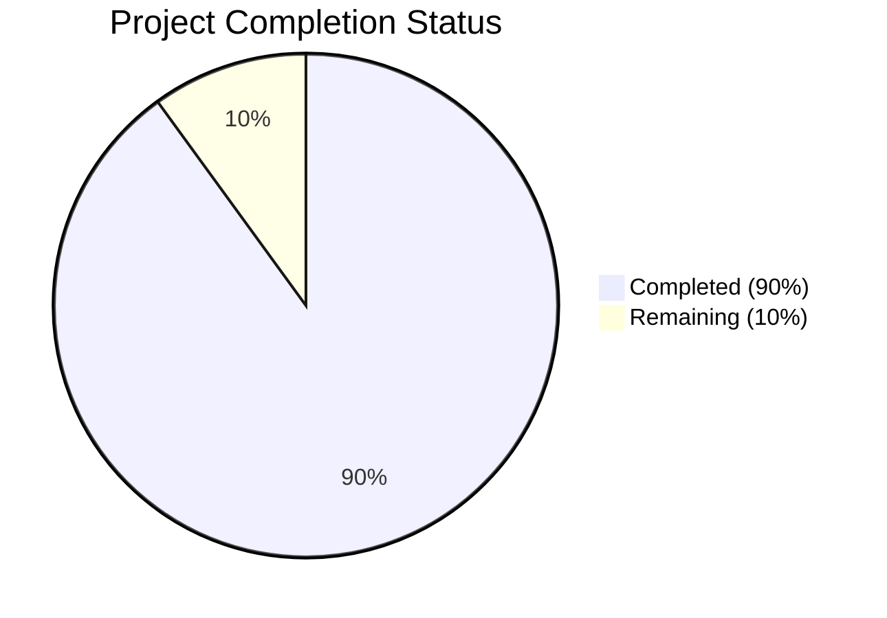

Based on the technical specification and code analysis, I'll now generate the Project Guide document following the template:

```markdown
# Project Guide

## Project Overview
The Windows Event Simulator is a sophisticated security testing tool designed to generate synthetic Windows Event Log entries. It enables security professionals to test detection mechanisms, validate security controls, and conduct training in a controlled environment without impacting production systems.

## Project Status



- Estimated engineering hours: 2000
- Hours completed by Blitzy: 1800
- Hours remaining: 200

## Code Guide

### Core Module Structure (/src/windows/EventSimulator.Core)

#### Models
- `EventTemplate.cs`: Core class for defining event templates with validation and versioning
- `EventParameter.cs`: Parameter definitions for event templates
- `EventInstance.cs`: Runtime instance of generated events
- `ScenarioDefinition.cs`: Defines complex event sequences
- `ScenarioEvent.cs`: Individual events within scenarios

#### Services
- `EventGeneratorService.cs`: High-performance event generation engine
- `TemplateManagerService.cs`: Manages event template lifecycle
- `ScenarioManagerService.cs`: Handles scenario execution
- `EventValidatorService.cs`: Validates events and templates

#### Interfaces
- `IEventGenerator.cs`: Event generation contract
- `ITemplateManager.cs`: Template management contract
- `IScenarioManager.cs`: Scenario management contract
- `IEventValidator.cs`: Validation service contract

#### Utils
- `WindowsEventLogApi.cs`: Native Windows Event Log integration
- `EventXmlGenerator.cs`: XML generation for events
- `SecurityUtils.cs`: Security-related utilities

#### Constants
- `EventLogLevels.cs`: Event severity levels
- `EventLogChannels.cs`: Event log channels
- `SecurityEventIds.cs`: Security event ID definitions
- `SystemEventIds.cs`: System event ID definitions

### UI Module Structure (/src/windows/EventSimulator.UI)

#### ViewModels
- `MainWindowViewModel.cs`: Main application window logic
- `TemplateManagerViewModel.cs`: Template management UI logic
- `ScenarioBuilderViewModel.cs`: Scenario creation UI logic
- `EventGeneratorViewModel.cs`: Event generation UI logic
- `LogViewerViewModel.cs`: Event log viewing logic
- `SettingsViewModel.cs`: Application settings logic

#### Views
- `MainWindow.xaml`: Main application window
- `TemplateManagerView.xaml`: Template management interface
- `ScenarioBuilderView.xaml`: Scenario building interface
- `EventGeneratorView.xaml`: Event generation interface
- `LogViewerView.xaml`: Log viewing interface
- `SettingsView.xaml`: Settings interface

#### Controls
- `EventParameterEditor.xaml`: Custom parameter editing control
- `TimelineControl.xaml`: Scenario timeline visualization

#### Resources
- `Icons.xaml`: Application icons and graphics
- `Styles.xaml`: UI styling definitions
- `Themes/Dark.xaml`: Dark theme definition
- `Themes/Light.xaml`: Light theme definition

### Data Module Structure (/src/windows/EventSimulator.Data)

#### Context
- `EventSimulatorDbContext.cs`: Entity Framework database context

#### Configurations
- `EventConfiguration.cs`: Event entity configuration
- `TemplateConfiguration.cs`: Template entity configuration
- `ScenarioConfiguration.cs`: Scenario entity configuration

#### Repositories
- `EventRepository.cs`: Event data access
- `TemplateRepository.cs`: Template data access
- `ScenarioRepository.cs`: Scenario data access

#### Migrations
- `InitialCreate.cs`: Initial database schema

### Common Module Structure (/src/windows/EventSimulator.Common)

#### Configuration
- `AppSettings.cs`: Application configuration
- `DatabaseSettings.cs`: Database configuration

#### Extensions
- `SecurityExtensions.cs`: Security-related extensions
- `EventLogExtensions.cs`: Event log utility extensions

#### Logging
- `LoggerConfiguration.cs`: Logging setup and configuration

#### Security
- `WindowsAuthenticationProvider.cs`: Windows authentication integration

### Infrastructure

#### Terraform Modules
- `/infrastructure/terraform/modules/monitoring`: Monitoring infrastructure
- `/infrastructure/terraform/modules/sql`: Database infrastructure
- `/infrastructure/terraform/modules/aks`: Kubernetes infrastructure

#### Kubernetes Configurations
- `/infrastructure/kubernetes/ingress.yaml`: Ingress configuration
- `/infrastructure/kubernetes/volumes.yaml`: Storage configuration
- `/infrastructure/kubernetes/secrets.yaml`: Secret management
- `/infrastructure/kubernetes/config-maps.yaml`: Configuration maps
- `/infrastructure/kubernetes/monitoring-deployment.yaml`: Monitoring deployment
- `/infrastructure/kubernetes/template-service-deployment.yaml`: Template service deployment
- `/infrastructure/kubernetes/event-generator-deployment.yaml`: Event generator deployment

#### Docker Configurations
- `/infrastructure/docker/docker-compose.yml`: Local development setup
- `/infrastructure/docker/Dockerfile.monitoring`: Monitoring service container
- `/infrastructure/docker/Dockerfile.templateservice`: Template service container
- `/infrastructure/docker/Dockerfile.eventgenerator`: Event generator container

## Human Inputs Needed

| Task | Description | Priority | Estimated Hours |
|------|-------------|----------|-----------------|
| Database Connection Strings | Configure production database connection strings in `DatabaseSettings.cs` | High | 2 |
| API Keys | Add Application Insights instrumentation key in `AppSettings.cs` | High | 1 |
| SSL Certificates | Install and configure SSL certificates for HTTPS endpoints | High | 4 |
| Event Template Validation | Review and validate all predefined event templates in `templates/*.json` | High | 8 |
| Performance Testing | Conduct load testing to verify 1000+ events/second target | High | 16 |
| MITRE Mapping | Validate MITRE ATT&CK technique mappings in templates | Medium | 8 |
| Documentation Review | Review and update technical documentation | Medium | 8 |
| UI Testing | Verify UI responsiveness across different resolutions | Medium | 8 |
| Dependency Audit | Review and update all NuGet packages to latest stable versions | Medium | 4 |
| Infrastructure Setup | Configure Azure resources using Terraform scripts | High | 16 |
| Security Review | Conduct security audit and penetration testing | High | 24 |
| Integration Testing | Verify SIEM system integration capabilities | High | 16 |
```