# Technical Specifications

# 1. INTRODUCTION

## 1.1 EXECUTIVE SUMMARY

The Windows Event Simulator is a specialized security testing tool designed to generate synthetic Windows Event Log entries that accurately replicate real-world security incidents and system behaviors. This tool addresses the critical need for security professionals to test detection mechanisms, validate security controls, and conduct training in a controlled environment without impacting production systems. Primary stakeholders include security engineers, system administrators, and security trainers who require a reliable method to simulate security events for testing and training purposes.

The system will provide significant value by enabling organizations to proactively validate their security monitoring capabilities, train staff on incident response procedures, and verify security controls without introducing actual vulnerabilities or risks to their environment.

## 1.2 SYSTEM OVERVIEW

### Project Context

| Aspect | Description |
|--------|-------------|
| Business Context | Security teams need reliable testing tools for Windows event detection and response capabilities |
| Current Limitations | Existing solutions often require actual system manipulation or lack comprehensive event simulation capabilities |
| Enterprise Integration | Complements existing SIEM systems, security monitoring tools, and training environments |

### High-Level Description

| Component | Details |
|-----------|----------|
| Event Generation Engine | Core system for creating synthetic Windows Events across Security, System, and Application logs |
| Template Management | Repository of predefined and custom event patterns based on known vulnerabilities |
| Scenario Builder | Tool for creating complex event sequences that simulate complete attack patterns |
| Integration Layer | Interfaces with Windows Event Log architecture and external security tools |

### Success Criteria

| Criterion | Target Metric |
|-----------|---------------|
| Event Generation Accuracy | 99.9% conformance to Windows Event Log specifications |
| System Performance | Generation of 1000+ events per second |
| Template Coverage | Support for top 100 MITRE ATT&CK techniques |
| User Adoption | 90% user satisfaction rating in initial deployment |

## 1.3 SCOPE

### In-Scope Elements

#### Core Features and Functionalities

| Feature Category | Components |
|-----------------|------------|
| Event Generation | - Single event creation<br>- Batch event generation<br>- Custom event parameters<br>- Event correlation support |
| Template Management | - Predefined vulnerability templates<br>- Custom template creation<br>- Template versioning<br>- Import/export capabilities |
| Scenario Management | - Attack scenario creation<br>- Timeline-based sequencing<br>- Conditional event triggers<br>- Scheduling capabilities |
| Integration | - Windows Event Log API integration<br>- SIEM system export<br>- Monitoring tool compatibility |

#### Implementation Boundaries

| Boundary Type | Coverage |
|--------------|----------|
| System Support | Windows 10 and Server 2016 or later |
| User Groups | Security teams, system administrators, security trainers |
| Data Domains | Security events, system events, application events |
| Deployment Scope | On-premises Windows environments |

### Out-of-Scope Elements

- Modification of actual system events or logs
- Real-time event interception or manipulation
- Network traffic generation or simulation
- Non-Windows operating system support
- Cloud-based event generation
- Mobile device event simulation
- Third-party application-specific events
- Historical event log modification
- Active Directory event replication
- Distributed event generation across domains

# 2. SYSTEM ARCHITECTURE

## 2.1 High-Level Architecture

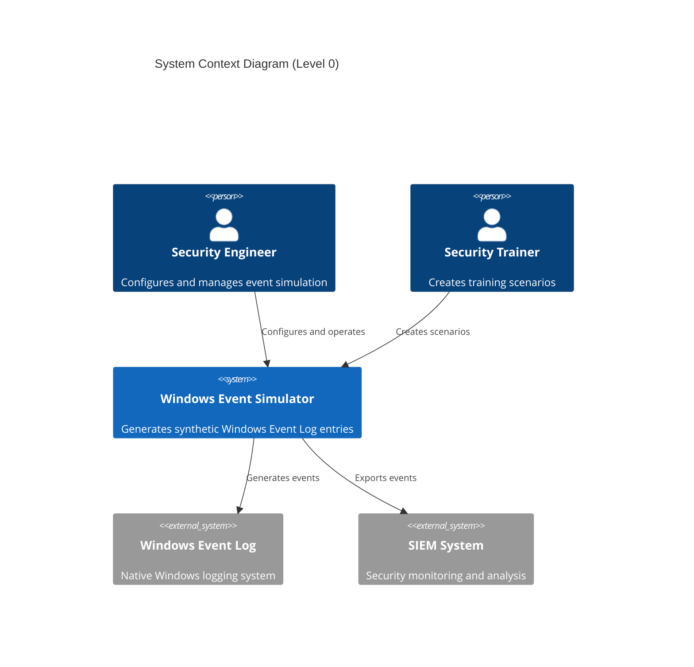
```mermaid
C4Context
    title System Context Diagram (Level 0)
    
    Person(securityEngineer, "Security Engineer", "Configures and manages event simulation")
    Person(trainer, "Security Trainer", "Creates training scenarios")
    
    System(eventSimulator, "Windows Event Simulator", "Generates synthetic Windows Event Log entries")
    
    System_Ext(windowsEventLog, "Windows Event Log", "Native Windows logging system")
    System_Ext(siem, "SIEM System", "Security monitoring and analysis")
    
    Rel(securityEngineer, eventSimulator, "Configures and operates")
    Rel(trainer, eventSimulator, "Creates scenarios")
    Rel(eventSimulator, windowsEventLog, "Generates events")
    Rel(eventSimulator, siem, "Exports events")
```

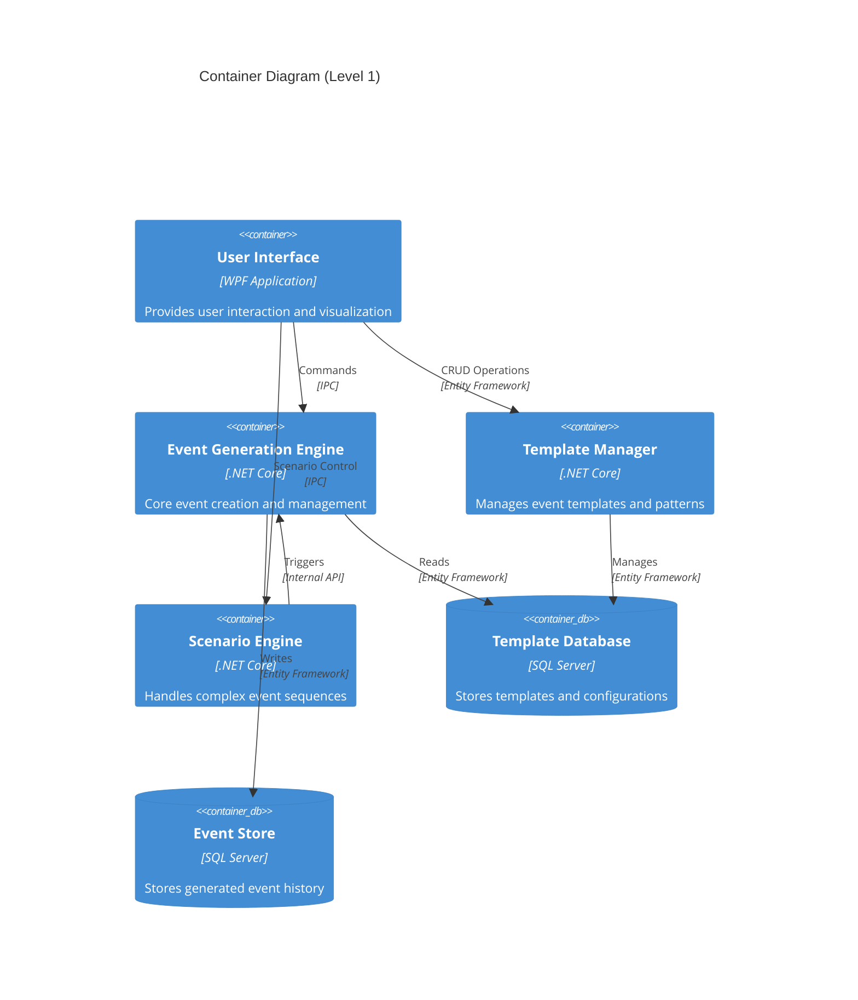
```mermaid
C4Container
    title Container Diagram (Level 1)
    
    Container(ui, "User Interface", "WPF Application", "Provides user interaction and visualization")
    Container(eventEngine, "Event Generation Engine", ".NET Core", "Core event creation and management")
    Container(templateMgr, "Template Manager", ".NET Core", "Manages event templates and patterns")
    Container(scenarioEngine, "Scenario Engine", ".NET Core", "Handles complex event sequences")
    
    ContainerDb(templateDb, "Template Database", "SQL Server", "Stores templates and configurations")
    ContainerDb(eventStore, "Event Store", "SQL Server", "Stores generated event history")
    
    Rel(ui, eventEngine, "Commands", "IPC")
    Rel(ui, templateMgr, "CRUD Operations", "Entity Framework")
    Rel(ui, scenarioEngine, "Scenario Control", "IPC")
    
    Rel(eventEngine, templateDb, "Reads", "Entity Framework")
    Rel(eventEngine, eventStore, "Writes", "Entity Framework")
    Rel(templateMgr, templateDb, "Manages", "Entity Framework")
    Rel(scenarioEngine, eventEngine, "Triggers", "Internal API")
```

## 2.2 Component Details

### 2.2.1 Core Components

| Component | Purpose | Technology Stack | Key Interfaces |
|-----------|---------|-----------------|----------------|
| Event Generation Engine | Event creation and validation | .NET Core 6.0, C# | IEventGenerator, IEventValidator |
| Template Manager | Template CRUD operations | Entity Framework Core | ITemplateRepository, ITemplateService |
| Scenario Engine | Sequence management | .NET Core 6.0, TPL | IScenarioRunner, IScheduler |
| User Interface | User interaction | WPF, MVVM pattern | IUIService, ICommandHandler |

### 2.2.2 Supporting Services

| Service | Purpose | Implementation | Scale Requirements |
|---------|---------|----------------|-------------------|
| Logging Service | Activity tracking | Serilog, ETW | 10K events/second |
| Cache Manager | Template caching | Memory Cache | 5GB max memory |
| Export Service | Data extraction | Custom ETL | 1K events/second |
| Validation Service | Data integrity | FluentValidation | Sub-100ms response |

## 2.3 Technical Decisions

### 2.3.1 Architecture Patterns

| Pattern | Implementation | Justification |
|---------|----------------|---------------|
| Layered Architecture | UI, Business, Data layers | Clear separation of concerns |
| Event-Driven | Publisher/Subscriber | Loose coupling between components |
| Repository Pattern | Data access abstraction | Centralized data management |
| CQRS | Command/Query separation | Performance optimization |

### 2.3.2 Data Storage

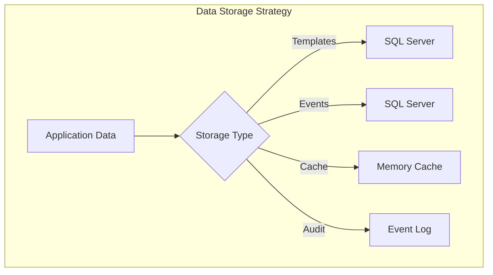
```mermaid
graph TB
    subgraph "Data Storage Strategy"
        A[Application Data] --> B{Storage Type}
        B -->|Templates| C[SQL Server]
        B -->|Events| D[SQL Server]
        B -->|Cache| E[Memory Cache]
        B -->|Audit| F[Event Log]
    end
```

## 2.4 Cross-Cutting Concerns

### 2.4.1 Monitoring Architecture

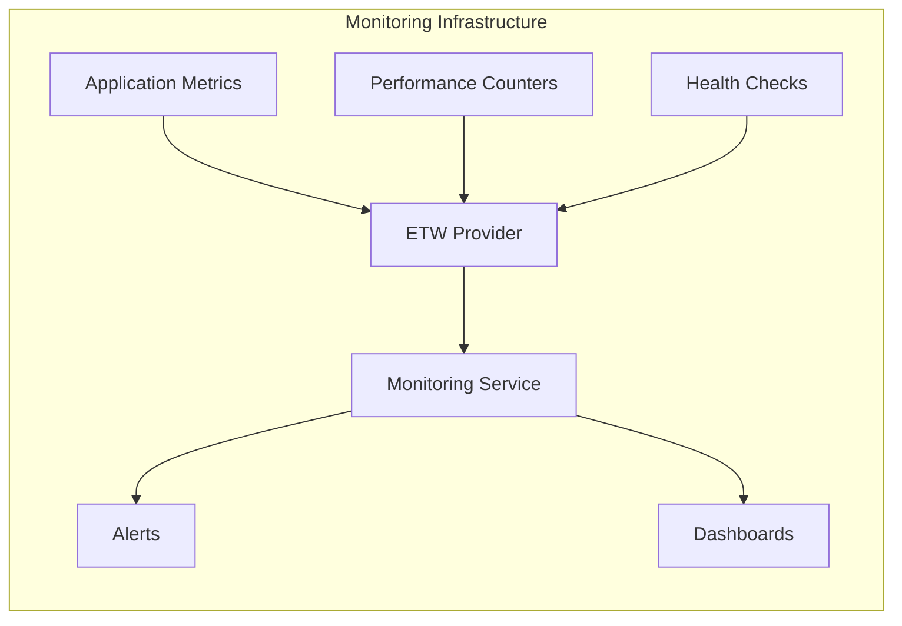
```mermaid
graph LR
    subgraph "Monitoring Infrastructure"
        A[Application Metrics] --> B[ETW Provider]
        C[Performance Counters] --> B
        D[Health Checks] --> B
        B --> E[Monitoring Service]
        E --> F[Alerts]
        E --> G[Dashboards]
    end
```

### 2.4.2 Security Architecture

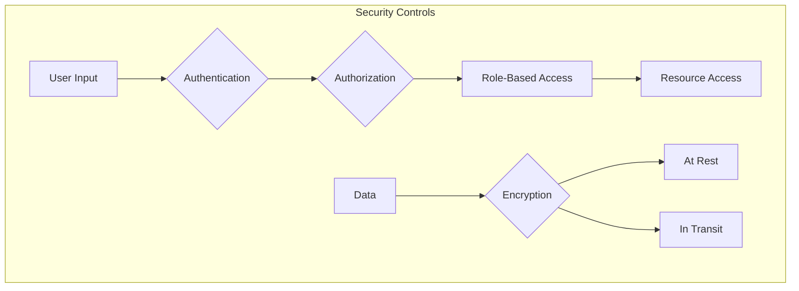
```mermaid
graph TB
    subgraph "Security Controls"
        A[User Input] --> B{Authentication}
        B --> C{Authorization}
        C --> D[Role-Based Access]
        D --> E[Resource Access]
        
        F[Data] --> G{Encryption}
        G --> H[At Rest]
        G --> I[In Transit]
    end
```

## 2.5 Deployment Architecture

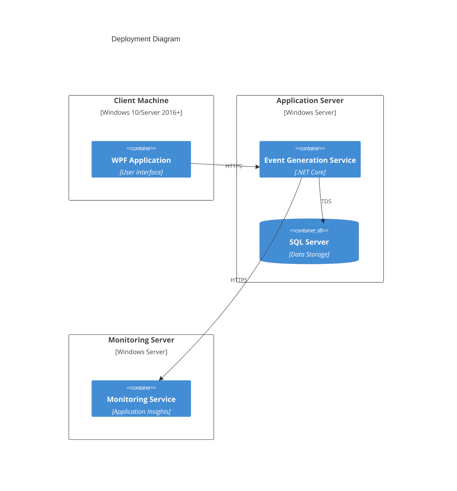
```mermaid
C4Deployment
    title Deployment Diagram
    
    Deployment_Node(client, "Client Machine", "Windows 10/Server 2016+"){
        Container(clientApp, "WPF Application", "User Interface")
    }
    
    Deployment_Node(server, "Application Server", "Windows Server"){
        Container(api, "Event Generation Service", ".NET Core")
        ContainerDb(db, "SQL Server", "Data Storage")
    }
    
    Deployment_Node(monitoring, "Monitoring Server", "Windows Server"){
        Container(monitor, "Monitoring Service", "Application Insights")
    }
    
    Rel(clientApp, api, "HTTPS")
    Rel(api, db, "TDS")
    Rel(api, monitor, "HTTPS")
```

### 2.5.1 Infrastructure Requirements

| Component | Minimum Specs | Recommended Specs |
|-----------|--------------|-------------------|
| Application Server | 4 CPU, 8GB RAM | 8 CPU, 16GB RAM |
| Database Server | 4 CPU, 16GB RAM | 8 CPU, 32GB RAM |
| Client Machine | 2 CPU, 4GB RAM | 4 CPU, 8GB RAM |
| Network | 100Mbps | 1Gbps |

### 2.5.2 Scaling Strategy

| Aspect | Strategy | Implementation |
|--------|----------|----------------|
| Vertical Scaling | Resource addition | Dynamic resource allocation |
| Horizontal Scaling | Instance replication | Load balancer distribution |
| Database Scaling | Partitioning | Table partitioning by date |
| Cache Scaling | Distributed cache | Redis cluster |

# 3. SYSTEM COMPONENTS ARCHITECTURE

## 3.1 USER INTERFACE DESIGN

### 3.1.1 Design Specifications

| Aspect | Requirement | Implementation |
|--------|-------------|----------------|
| Visual Framework | WPF/XAML-based interface | Material Design-inspired components |
| Layout System | Grid-based responsive layout | Dynamic scaling from 1024x768 to 4K |
| Theme Support | Dark/Light mode with custom accents | XAML ResourceDictionary theming |
| Accessibility | WCAG 2.1 Level AA | High contrast support, keyboard navigation |
| Localization | Multi-language support | Resource files for EN, ES, DE, FR |
| DPI Scaling | Vector-based assets | Support for 100% to 400% scaling |

### 3.1.2 Interface Layout

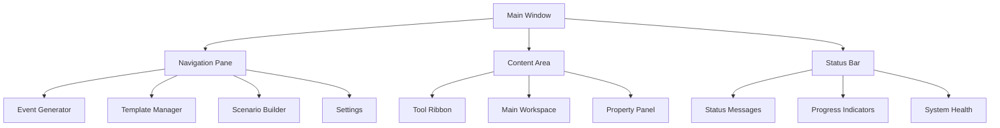
```mermaid
graph TD
    A[Main Window] --> B[Navigation Pane]
    A --> C[Content Area]
    A --> D[Status Bar]
    
    B --> E[Event Generator]
    B --> F[Template Manager]
    B --> G[Scenario Builder]
    B --> H[Settings]
    
    C --> I[Tool Ribbon]
    C --> J[Main Workspace]
    C --> K[Property Panel]
    
    D --> L[Status Messages]
    D --> M[Progress Indicators]
    D --> N[System Health]
```

### 3.1.3 Critical User Flows

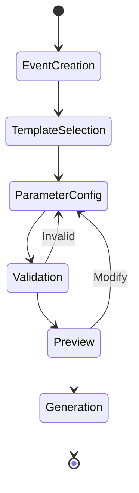
```mermaid
stateDiagram-v2
    [*] --> EventCreation
    EventCreation --> TemplateSelection
    TemplateSelection --> ParameterConfig
    ParameterConfig --> Validation
    Validation --> Preview
    Preview --> Generation
    Generation --> [*]
    
    Validation --> ParameterConfig: Invalid
    Preview --> ParameterConfig: Modify
```

### 3.1.4 Component Specifications

| Component | Behavior | Validation Rules |
|-----------|----------|------------------|
| Event Form | Dynamic field generation | Required fields, type validation |
| Template Grid | Virtual scrolling, filtering | Search validation, sort ordering |
| Parameter Editor | IntelliSense support | Range checks, format validation |
| Timeline View | Drag-drop scheduling | Temporal validation, overlap check |
| Log Viewer | Virtual scrolling, filtering | Filter syntax validation |

## 3.2 DATABASE DESIGN

### 3.2.1 Schema Design

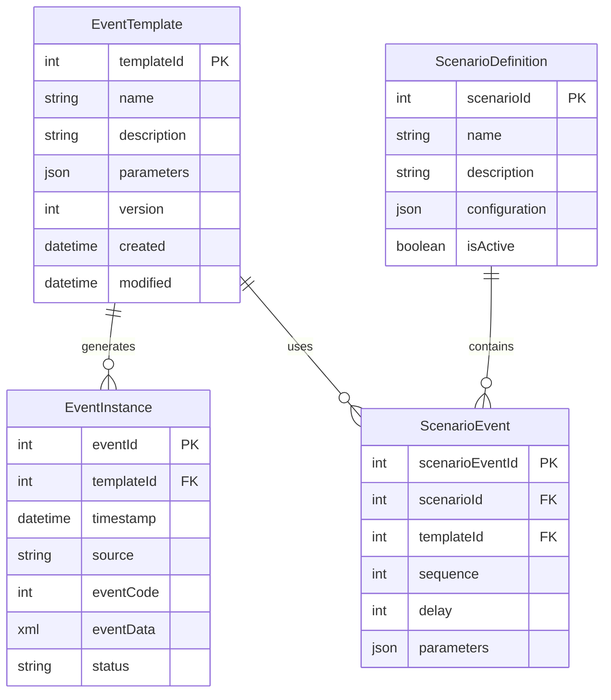
```mermaid
erDiagram
    EventTemplate {
        int templateId PK
        string name
        string description
        json parameters
        int version
        datetime created
        datetime modified
    }
    
    EventInstance {
        int eventId PK
        int templateId FK
        datetime timestamp
        string source
        int eventCode
        xml eventData
        string status
    }
    
    ScenarioDefinition {
        int scenarioId PK
        string name
        string description
        json configuration
        boolean isActive
    }
    
    ScenarioEvent {
        int scenarioEventId PK
        int scenarioId FK
        int templateId FK
        int sequence
        int delay
        json parameters
    }
    
    EventTemplate ||--o{ EventInstance : "generates"
    ScenarioDefinition ||--o{ ScenarioEvent : "contains"
    EventTemplate ||--o{ ScenarioEvent : "uses"
```

### 3.2.2 Data Management Strategy

| Aspect | Strategy | Implementation |
|--------|----------|----------------|
| Partitioning | Date-based partitioning | Monthly partitions for event data |
| Indexing | Covering indexes for queries | Filtered indexes for active records |
| Archival | Sliding window retention | 90-day active window, archive older |
| Backup | Differential backup strategy | 15-minute transaction log backup |
| Encryption | TDE for data at rest | Column encryption for sensitive data |

### 3.2.3 Performance Optimization

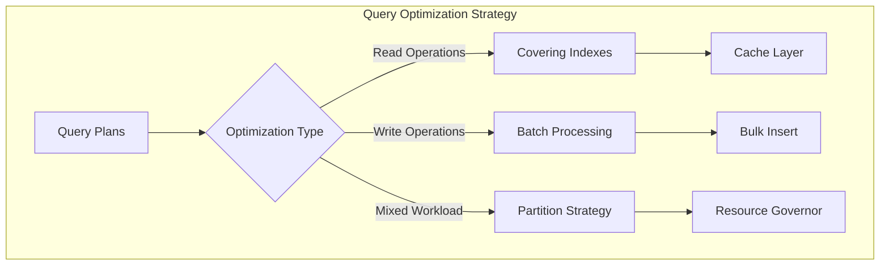
```mermaid
graph TB
    subgraph "Query Optimization Strategy"
        A[Query Plans] --> B{Optimization Type}
        B -->|Read Operations| C[Covering Indexes]
        B -->|Write Operations| D[Batch Processing]
        B -->|Mixed Workload| E[Partition Strategy]
        
        C --> F[Cache Layer]
        D --> G[Bulk Insert]
        E --> H[Resource Governor]
    end
```

## 3.3 API DESIGN

### 3.3.1 API Architecture

| Component | Specification | Implementation |
|-----------|--------------|----------------|
| Protocol | REST over HTTPS | TLS 1.3 required |
| Authentication | OAuth 2.0 + JWT | Token-based access |
| Rate Limiting | Token bucket algorithm | 1000 requests/hour |
| Versioning | URI versioning | /api/v1/ prefix |
| Documentation | OpenAPI 3.0 | Swagger UI integration |

### 3.3.2 Endpoint Specifications

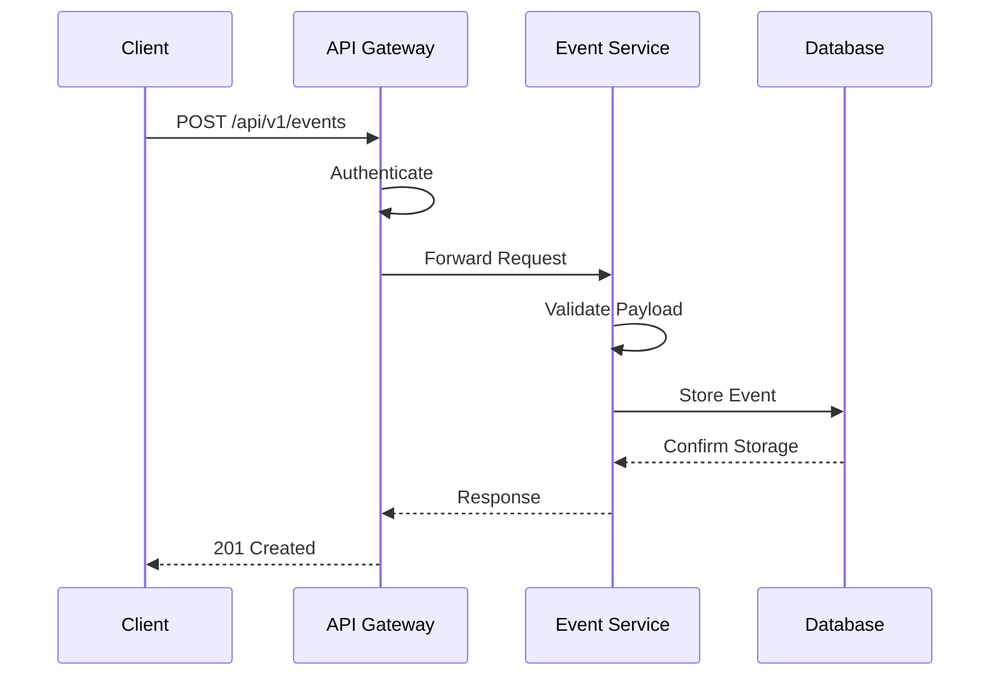
```mermaid
sequenceDiagram
    participant C as Client
    participant A as API Gateway
    participant S as Event Service
    participant D as Database

    C->>A: POST /api/v1/events
    A->>A: Authenticate
    A->>S: Forward Request
    S->>S: Validate Payload
    S->>D: Store Event
    D-->>S: Confirm Storage
    S-->>A: Response
    A-->>C: 201 Created
```

### 3.3.3 Integration Interfaces

| Interface | Purpose | Protocol |
|-----------|---------|----------|
| Event Generation | Create synthetic events | REST API |
| Template Management | CRUD operations for templates | REST API |
| Scenario Execution | Control scenario playback | WebSocket |
| System Monitoring | Health and metrics | REST API |
| Event Export | Bulk data extraction | REST API |

### 3.3.4 API Security Controls

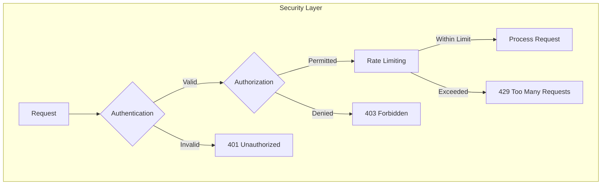
```mermaid
graph TB
    subgraph "Security Layer"
        A[Request] --> B{Authentication}
        B -->|Valid| C{Authorization}
        B -->|Invalid| D[401 Unauthorized]
        
        C -->|Permitted| E[Rate Limiting]
        C -->|Denied| F[403 Forbidden]
        
        E -->|Within Limit| G[Process Request]
        E -->|Exceeded| H[429 Too Many Requests]
    end
```

# 4. TECHNOLOGY STACK

## 4.1 PROGRAMMING LANGUAGES

| Platform/Component | Language | Version | Justification |
|-------------------|----------|---------|---------------|
| Core Application | C# | 10.0 | - Native Windows integration<br>- Strong type safety<br>- Extensive Windows API support |
| User Interface | XAML | Latest | - Native WPF support<br>- Rich UI component library<br>- Responsive design capabilities |
| Database Access | T-SQL | 2019 | - SQL Server optimization<br>- Complex query support<br>- Stored procedure capabilities |
| Scripting Support | PowerShell | 7.2 | - Windows event manipulation<br>- System automation<br>- Admin tooling integration |

## 4.2 FRAMEWORKS & LIBRARIES

### 4.2.1 Core Frameworks

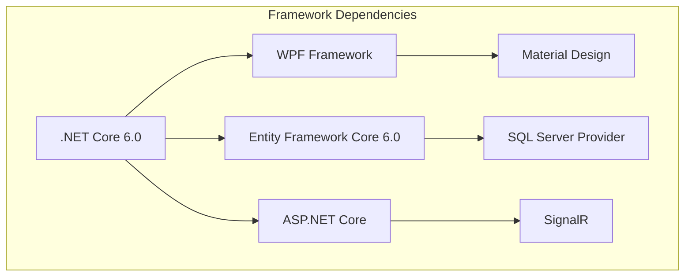
```mermaid
graph TB
    subgraph "Framework Dependencies"
        A[.NET Core 6.0] --> B[WPF Framework]
        A --> C[Entity Framework Core 6.0]
        A --> D[ASP.NET Core]
        
        B --> E[Material Design]
        C --> F[SQL Server Provider]
        D --> G[SignalR]
    end
```

| Framework | Version | Purpose | Justification |
|-----------|---------|---------|---------------|
| .NET Core | 6.0 | Application Framework | - Cross-version Windows support<br>- Modern development features<br>- Long-term support |
| WPF | Latest | UI Framework | - Native Windows UI development<br>- MVVM pattern support<br>- Rich control library |
| Entity Framework Core | 6.0 | Data Access | - ORM capabilities<br>- LINQ support<br>- Migration management |
| Serilog | 2.12.0 | Logging | - Structured logging<br>- Multiple sink support<br>- High performance |

### 4.2.2 Supporting Libraries

| Library | Version | Purpose |
|---------|---------|---------|
| AutoMapper | 12.0 | Object mapping |
| FluentValidation | 11.0 | Input validation |
| Newtonsoft.Json | 13.0 | JSON processing |
| Moq | 4.18 | Unit testing |
| Polly | 7.2 | Resilience patterns |

## 4.3 DATABASES & STORAGE

### 4.3.1 Primary Database

| Component | Technology | Version | Purpose |
|-----------|------------|---------|---------|
| RDBMS | SQL Server | 2019 | Primary data store |
| Cache | Redis | 6.2 | Template caching |
| File Storage | NTFS | Latest | Event log storage |

### 4.3.2 Data Architecture

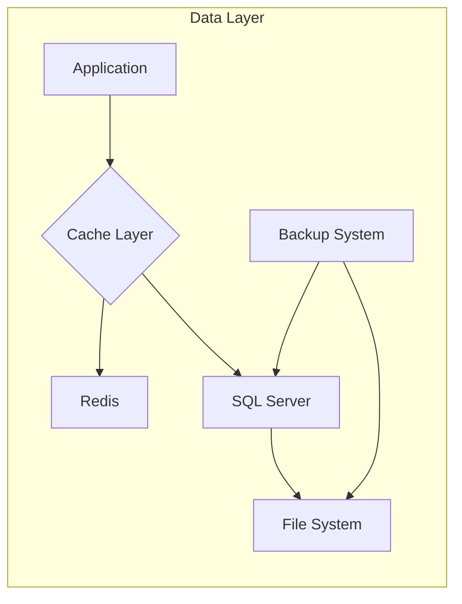
```mermaid
graph LR
    subgraph "Data Layer"
        A[Application] --> B{Cache Layer}
        B --> C[Redis]
        B --> D[SQL Server]
        D --> E[File System]
        
        F[Backup System] --> D
        F --> E
    end
```

## 4.4 THIRD-PARTY SERVICES

| Service | Purpose | Integration Method |
|---------|---------|-------------------|
| Windows Event Log API | Event generation | Native Windows API |
| ETW Providers | Performance monitoring | ETW Framework |
| Active Directory | Authentication | LDAP/Windows Auth |
| Application Insights | Telemetry | SDK Integration |

## 4.5 DEVELOPMENT & DEPLOYMENT

### 4.5.1 Development Tools

| Tool | Version | Purpose |
|------|---------|---------|
| Visual Studio | 2022 | Primary IDE |
| Git | Latest | Version control |
| Azure DevOps | Latest | Project management |
| ReSharper | 2022.2 | Code quality |

### 4.5.2 Build & Deployment Pipeline

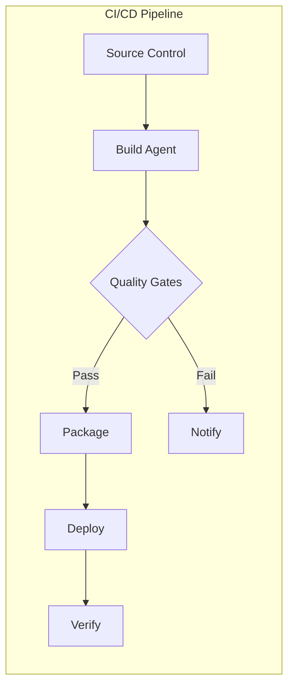
```mermaid
graph LR
    subgraph "CI/CD Pipeline"
        A[Source Control] --> B[Build Agent]
        B --> C{Quality Gates}
        C -->|Pass| D[Package]
        C -->|Fail| E[Notify]
        D --> F[Deploy]
        F --> G[Verify]
    end
```

### 4.5.3 Deployment Requirements

| Requirement | Implementation |
|-------------|----------------|
| Installation | Windows Installer (MSI) |
| Updates | ClickOnce deployment |
| Configuration | Group Policy integration |
| Monitoring | Application Insights |

### 4.5.4 Environment Specifications

| Environment | Purpose | Configuration |
|-------------|---------|---------------|
| Development | Local development | VS2022 + SQL Express |
| Testing | Integration testing | Dedicated test server |
| Staging | Pre-production | Production mirror |
| Production | Live deployment | High-availability cluster |

# 5. SYSTEM DESIGN

## 5.1 USER INTERFACE DESIGN

### 5.1.1 Main Application Layout

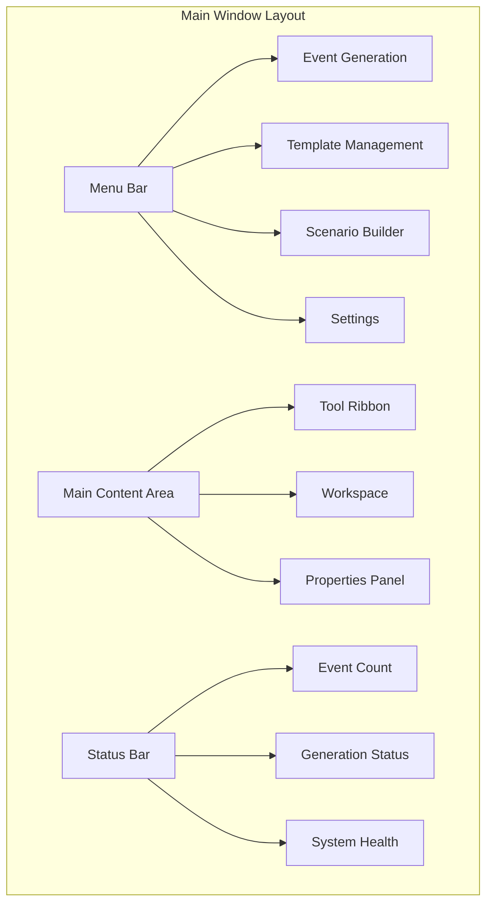
```mermaid
graph TD
    subgraph "Main Window Layout"
        A[Menu Bar] --> B[Event Generation]
        A --> C[Template Management]
        A --> D[Scenario Builder]
        A --> E[Settings]
        
        F[Main Content Area] --> G[Tool Ribbon]
        F --> H[Workspace]
        F --> I[Properties Panel]
        
        J[Status Bar] --> K[Event Count]
        J --> L[Generation Status]
        J --> M[System Health]
    end
```

### 5.1.2 Event Generation Interface

| Component | Description | Functionality |
|-----------|-------------|---------------|
| Event Type Selector | Dropdown menu | Select Security/System/Application events |
| Parameter Grid | Data grid | Configure event parameters with validation |
| Preview Panel | Read-only view | Show formatted event before generation |
| Generation Controls | Button group | Start/Stop/Pause event generation |
| Batch Settings | Input fields | Configure volume and frequency |

### 5.1.3 Template Management Interface

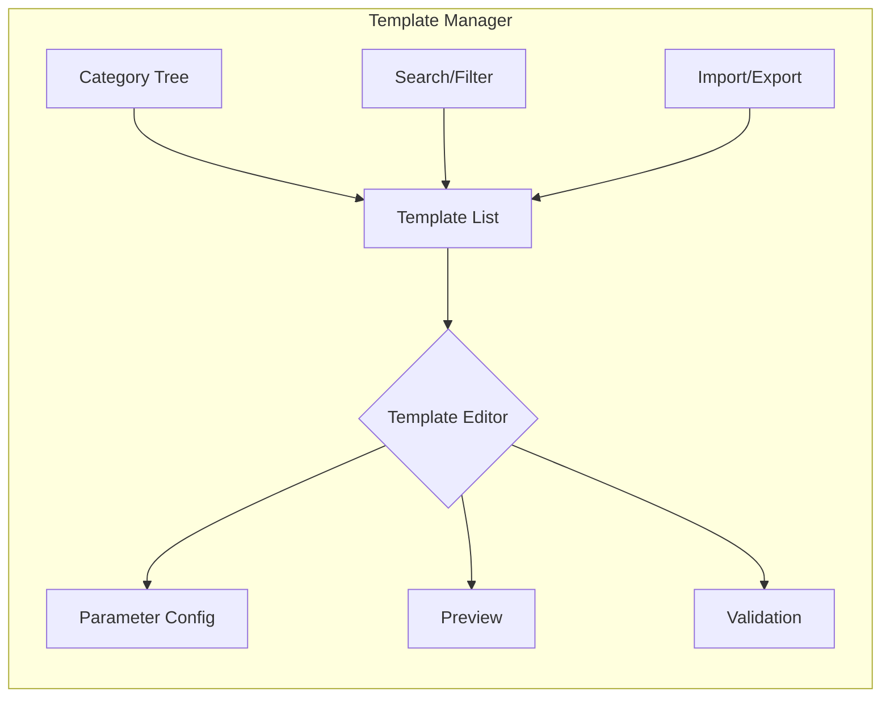
```mermaid
graph LR
    subgraph "Template Manager"
        A[Template List] --> B{Template Editor}
        B --> C[Parameter Config]
        B --> D[Preview]
        B --> E[Validation]
        
        F[Category Tree] --> A
        G[Search/Filter] --> A
        
        H[Import/Export] --> A
    end
```

## 5.2 DATABASE DESIGN

### 5.2.1 Schema Design

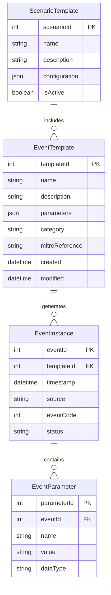
```mermaid
erDiagram
    EventTemplate ||--o{ EventInstance : generates
    EventTemplate {
        int templateId PK
        string name
        string description
        json parameters
        string category
        string mitreReference
        datetime created
        datetime modified
    }
    
    EventInstance ||--o{ EventParameter : contains
    EventInstance {
        int eventId PK
        int templateId FK
        datetime timestamp
        string source
        int eventCode
        string status
    }
    
    EventParameter {
        int parameterId PK
        int eventId FK
        string name
        string value
        string dataType
    }
    
    ScenarioTemplate ||--o{ EventTemplate : includes
    ScenarioTemplate {
        int scenarioId PK
        string name
        string description
        json configuration
        boolean isActive
    }
```

### 5.2.2 Data Access Layer

| Component | Implementation | Purpose |
|-----------|----------------|----------|
| Entity Framework Core | Code-first approach | ORM for data access |
| Repository Pattern | Generic repositories | Data access abstraction |
| Unit of Work | Transaction management | Data consistency |
| Query Specifications | Specification pattern | Complex query handling |

## 5.3 API DESIGN

### 5.3.1 Internal APIs

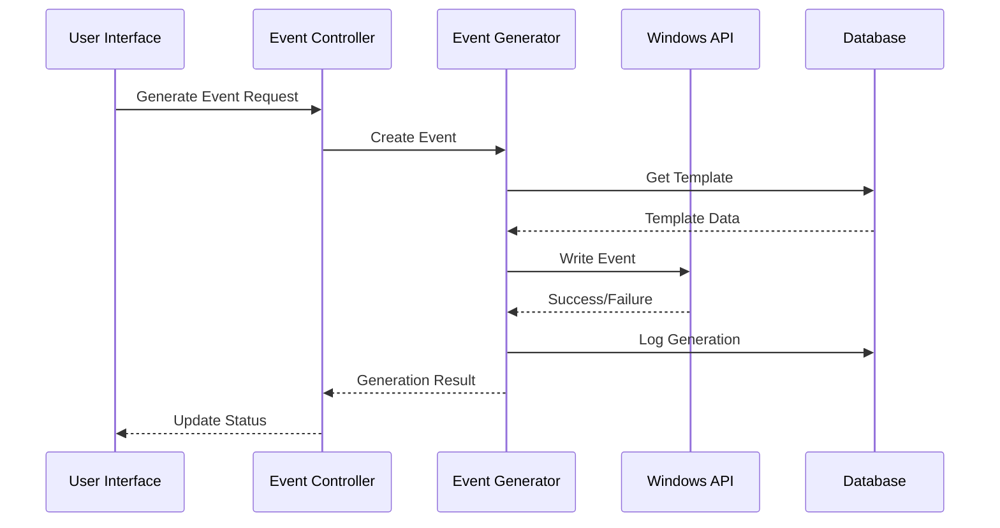
```mermaid
sequenceDiagram
    participant UI as User Interface
    participant EC as Event Controller
    participant EG as Event Generator
    participant WA as Windows API
    participant DB as Database

    UI->>EC: Generate Event Request
    EC->>EG: Create Event
    EG->>DB: Get Template
    DB-->>EG: Template Data
    EG->>WA: Write Event
    WA-->>EG: Success/Failure
    EG->>DB: Log Generation
    EG-->>EC: Generation Result
    EC-->>UI: Update Status
```

### 5.3.2 External APIs

| Endpoint | Method | Purpose | Parameters |
|----------|--------|---------|------------|
| /api/events | POST | Generate single event | templateId, parameters |
| /api/events/batch | POST | Generate multiple events | templateId, count, interval |
| /api/templates | GET | Retrieve templates | category, search |
| /api/scenarios | POST | Execute scenario | scenarioId, configuration |

### 5.3.3 Integration Interfaces

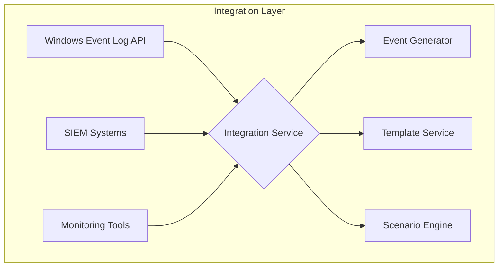
```mermaid
graph TB
    subgraph "Integration Layer"
        A[Windows Event Log API] --> B{Integration Service}
        C[SIEM Systems] --> B
        D[Monitoring Tools] --> B
        
        B --> E[Event Generator]
        B --> F[Template Service]
        B --> G[Scenario Engine]
    end
```

### 5.3.4 API Security

| Security Layer | Implementation | Purpose |
|----------------|----------------|----------|
| Authentication | Windows Auth | User identity verification |
| Authorization | Role-based | Access control |
| Rate Limiting | Token bucket | Prevent abuse |
| Input Validation | FluentValidation | Data integrity |
| Audit Logging | ETW Events | Activity tracking |

# 6. USER INTERFACE DESIGN

## 6.1 Interface Overview

The Windows Event Simulator uses a Windows Presentation Foundation (WPF) interface with a modern Material Design-inspired layout. The interface follows a multi-pane design pattern with docked windows and ribbon-style toolbars.

### 6.1.1 Common UI Elements Key

```
Symbols:
[=] - Main Menu
[#] - Dashboard
[+] - Add/Create New
[x] - Close/Delete
[?] - Help/Documentation
[i] - Information
[@] - User Profile
[!] - Warning/Alert
[^] - Upload/Import
[v] - Dropdown Menu
[<][>] - Navigation
[*] - Favorite/Important
```

## 6.2 Main Application Window

```
+--------------------------------------------------------------+
|  [=] Windows Event Simulator                     [@] [?] [x]  |
+--------------------------------------------------------------+
| [#]File | Templates | Scenarios | Tools | Settings | Help     |
+--------------------------------------------------------------+
|  +----------------+  +----------------------------------+     |
|  | Event Types    |  | Event Generator                  |     |
|  |                |  |                                  |     |
|  | > Security     |  | Event ID: [...................] |     |
|  | > System       |  | Source:  [v]                    |     |
|  | > Application  |  | Level:   [v] (Info/Warn/Error)  |     |
|  | > Custom       |  | User:    [...................] |     |
|  |                |  |                                  |     |
|  | [+] New Type   |  | Description:                    |     |
|  +----------------+  | [                              ] |     |
|                     | [                              ] |     |
|  +----------------+ |                                  |     |
|  | Templates      | | Parameters:                      |     |
|  | [*] Common     | | [ ] Include Extended Data        |     |
|  | [*] Security   | | [ ] Generate Correlated Events   |     |
|  | [*] Custom     | |                                  |     |
|  +----------------+ | [Generate Event] [Save Template]  |     |
|                     +----------------------------------+     |
|                                                             |
+-------------------------------------------------------------+
| Status: Ready                     Events Generated: 0        |
+-------------------------------------------------------------+
```

## 6.3 Template Manager

```
+--------------------------------------------------------------+
|  Template Manager                                    [?] [x]  |
+--------------------------------------------------------------+
| [+] New Template | [^] Import | [Save] | [Delete]            |
+--------------------------------------------------------------+
|  +----------------+  +----------------------------------+     |
|  | Categories     |  | Template Editor                  |     |
|  | > Authentication|  |                                 |     |
|  | > Privilege    |  | Name: [.....................]   |     |
|  | > Access       |  | ID:   [.....................]   |     |
|  | > Network      |  |                                 |     |
|  | > Custom       |  | Event Properties:               |     |
|  |                |  | +----------------------------+  |     |
|  | Filter: [...]  |  | | Property | Value | Type   |  |     |
|  +----------------+  | +----------------------------+  |     |
|                     | | Source   |[...] |[v]      |  |     |
|  Templates:         | | EventID  |[...] |[v]      |  |     |
|  [ ] Template 1     | | Level    |[...] |[v]      |  |     |
|  [ ] Template 2     | +----------------------------+  |     |
|  [ ] Template 3     |                                 |     |
|                     | [Test Template] [Save Changes]   |     |
+--------------------------------------------------------------+
| Status: 3 Templates Selected            [Export Selected] [v]  |
+--------------------------------------------------------------+
```

## 6.4 Scenario Builder

```
+--------------------------------------------------------------+
|  Scenario Builder                                    [?] [x]  |
+--------------------------------------------------------------+
| [+] New Scenario | [^] Import | [Save] | [Run Scenario]       |
+--------------------------------------------------------------+
|  Timeline:                                                    |
|  +----------------------------------------------------------+
|  | 0s     30s     60s     90s     120s    150s    180s      |
|  | |------|-------|-------|--------|--------|--------|       |
|  |                                                           |
|  | [Event 1]-->[Event 2]                                    |
|  |              |                                           |
|  |              +-->[Event 3]-->[Event 4]                   |
|  |                                                          |
|  +----------------------------------------------------------+
|  Event Properties:                                           |
|  +------------------+  +--------------------------------+    |
|  | Event List       |  | Selected Event                 |    |
|  | > Event 1        |  | Type: Security                 |    |
|  | > Event 2        |  | Delay: [30] seconds           |    |
|  | > Event 3        |  | Dependencies: [v] Event 1      |    |
|  | > Event 4        |  | Conditions: [Add Condition]    |    |
|  +------------------+  +--------------------------------+    |
|                                                             |
+--------------------------------------------------------------+
| Status: Ready to Run              Duration: 180 seconds       |
+--------------------------------------------------------------+
```

## 6.5 Log Viewer

```
+--------------------------------------------------------------+
|  Log Viewer                                         [?] [x]   |
+--------------------------------------------------------------+
| [Refresh] | [Filter] | [Export] | [Clear View]                |
+--------------------------------------------------------------+
| Search: [...........................] [Search]                 |
|                                                               |
| +------------------------------------------------------------+
| | Time       | ID    | Source    | Level   | Message          |
| |-----------------------------------------------------------|
| | 10:15:22   | 4624  | Security  | Info    | Login Success   |
| | 10:15:23   | 4688  | Security  | Info    | Process Created |
| | 10:15:25   | 4648  | Security  | Warning | Priv Elevation  |
| | 10:15:30   | 4625  | Security  | Error   | Login Failed    |
| |                                                             |
| |                                                             |
| +------------------------------------------------------------+
|                                                               |
| Event Details:                                                |
| +------------------------------------------------------------+
| | Event ID: 4624                                              |
| | Source: Security                                            |
| | Time: 10:15:22                                             |
| | Level: Information                                          |
| | Description: An account was successfully logged on.         |
| | Extended Data: [Show/Hide]                                  |
| +------------------------------------------------------------+
|                                                               |
+--------------------------------------------------------------+
| Events Displayed: 4 of 1,000          [<] 1 of 250 [>]       |
+--------------------------------------------------------------+
```

## 6.6 Settings Panel

```
+--------------------------------------------------------------+
|  Settings                                           [?] [x]   |
+--------------------------------------------------------------+
| General | Performance | Integration | Advanced                 |
+--------------------------------------------------------------+
|  +------------------+  +--------------------------------+     |
|  | Categories       |  | General Settings               |     |
|  | > General        |  |                               |     |
|  | > Events         |  | Theme:        [v] Dark        |     |
|  | > Templates      |  | Language:     [v] English     |     |
|  | > Export         |  | Auto-Save:    [ ] Enable      |     |
|  | > Integration    |  | Save Interval:[v] 5 minutes   |     |
|  | > Advanced       |  |                               |     |
|  |                  |  | Event Generation:             |     |
|  |                  |  | [====] Buffer Size: 1000      |     |
|  |                  |  | [====] Thread Count: 4        |     |
|  |                  |  |                               |     |
|  |                  |  | Logging:                      |     |
|  |                  |  | [ ] Enable Debug Logging      |     |
|  |                  |  | [ ] Archive Logs Weekly       |     |
|  +------------------+  +--------------------------------+     |
|                                                              |
| [Apply Changes] [Reset to Default]                           |
+--------------------------------------------------------------+
| Status: Unsaved Changes                [Save] [Cancel]        |
+--------------------------------------------------------------+
```

## 6.7 Responsive Design Specifications

The interface must scale appropriately across the following resolutions:
- Minimum: 1024x768
- Recommended: 1920x1080
- Maximum Supported: 3840x2160 (4K)

All components should maintain usability when:
- Window is resized
- Display scaling is changed (100% to 400%)
- Multiple monitors are used
- Different DPI settings are applied

## 6.8 Accessibility Features

- High contrast theme support
- Keyboard navigation with visible focus indicators
- Screen reader compatibility
- Configurable font sizes (8pt to 24pt)
- Tool tips for all interactive elements
- Customizable color schemes for color-blind users

# 7. SECURITY CONSIDERATIONS

## 7.1 AUTHENTICATION AND AUTHORIZATION

### 7.1.1 Authentication Methods

| Method | Implementation | Use Case |
|--------|----------------|-----------|
| Windows Authentication | Integrated Windows Security | Primary authentication for domain users |
| Local Authentication | Windows Security Provider | Standalone deployments |
| Certificate-based | X.509 certificates | Service accounts and automation |
| API Authentication | OAuth 2.0 + JWT | External system integration |

### 7.1.2 Authorization Model

```mermaid
graph TB
    subgraph "Role-Based Access Control"
        A[User] --> B{Authentication}
        B -->|Success| C[Role Assignment]
        B -->|Failure| D[Access Denied]
        
        C --> E{Authorization}
        E -->|Admin| F[Full Access]
        E -->|Security Engineer| G[Event Generation + Templates]
        E -->|Trainer| H[Scenario Creation]
        E -->|Viewer| I[Read-Only Access]
    end
```

### 7.1.3 Permission Matrix

| Role | Event Generation | Template Management | Scenario Creation | System Config | User Management |
|------|-----------------|-------------------|-------------------|---------------|-----------------|
| Administrator | Full Access | Full Access | Full Access | Full Access | Full Access |
| Security Engineer | Create/Modify | Create/Modify | Create/Modify | View Only | No Access |
| Trainer | Create Only | Use Only | Create/Modify | No Access | No Access |
| Viewer | View Only | View Only | View Only | No Access | No Access |

## 7.2 DATA SECURITY

### 7.2.1 Data Protection Measures

```mermaid
graph LR
    subgraph "Data Security Layers"
        A[Data Entry] --> B{Input Validation}
        B --> C[Sanitization]
        C --> D{Encryption}
        D --> E[Storage]
        D --> F[Transit]
        
        E --> G[AES-256]
        F --> H[TLS 1.3]
    end
```

### 7.2.2 Encryption Standards

| Data State | Encryption Method | Key Management |
|------------|------------------|----------------|
| At Rest | AES-256 | Windows DPAPI |
| In Transit | TLS 1.3 | Certificate Store |
| In Memory | SecureString | Runtime Protection |
| Configuration | AES-256 | Machine-specific keys |

### 7.2.3 Sensitive Data Handling

| Data Type | Protection Method | Access Control |
|-----------|------------------|----------------|
| Event Templates | Encrypted Storage | Role-based Access |
| User Credentials | Hash + Salt (PBKDF2) | Admin Only |
| API Keys | Encrypted Storage | Application Only |
| Audit Logs | Tamper-evident Storage | Read-only Access |

## 7.3 SECURITY PROTOCOLS

### 7.3.1 Operational Security

```mermaid
sequenceDiagram
    participant User
    participant App
    participant Security
    participant Audit
    
    User->>App: Request Operation
    App->>Security: Validate Permissions
    Security-->>App: Authorization Result
    App->>Security: Validate Operation
    Security-->>App: Operation Validation
    App->>Audit: Log Activity
    App-->>User: Operation Result
```

### 7.3.2 Security Controls

| Control Type | Implementation | Purpose |
|--------------|----------------|---------|
| Input Validation | FluentValidation | Prevent injection attacks |
| Session Management | Secure Session Handler | Prevent session hijacking |
| Audit Logging | ETW + SQL Server | Activity tracking |
| Error Handling | Custom Security Handler | Prevent information disclosure |
| Rate Limiting | Token Bucket Algorithm | Prevent DoS attacks |

### 7.3.3 Security Monitoring

| Monitoring Type | Implementation | Alert Threshold |
|----------------|----------------|-----------------|
| Failed Logins | Windows Security Events | 5 failures/minute |
| Suspicious Operations | Custom ETW Provider | Any unauthorized attempt |
| Resource Usage | Performance Counters | 80% utilization |
| Template Changes | Change Data Capture | Any modification |
| System Access | Windows Security Log | Privilege elevation |

### 7.3.4 Compliance Requirements

| Requirement | Implementation | Validation |
|-------------|----------------|------------|
| Audit Trail | SQL Server CDC | Daily integrity check |
| Access Control | Windows Security | Monthly review |
| Data Protection | Encryption Services | Quarterly assessment |
| Incident Response | Alert System | Annual testing |
| Documentation | Security Policies | Semi-annual update |

### 7.3.5 Security Update Process

```mermaid
graph TB
    subgraph "Security Update Workflow"
        A[Security Update Available] --> B{Risk Assessment}
        B -->|Critical| C[Emergency Update]
        B -->|High| D[Scheduled Update]
        B -->|Low| E[Regular Update Cycle]
        
        C --> F[Deploy]
        D --> G[Test]
        G --> F
        E --> H[Batch Processing]
        H --> G
        
        F --> I[Verify]
        I --> J[Document]
    end
```

# 8. INFRASTRUCTURE

## 8.1 DEPLOYMENT ENVIRONMENT

### 8.1.1 Target Environments

| Environment Type | Primary Use | Requirements |
|-----------------|-------------|--------------|
| Development | Local development and testing | Windows 10/11 Pro, Visual Studio 2022, SQL Server Express |
| Testing | Integration and system testing | Windows Server 2019+, SQL Server Standard |
| Staging | Pre-production validation | Mirror of production environment |
| Production | Live deployment | Windows Server 2022, SQL Server Enterprise |

### 8.1.2 Environment Architecture

```mermaid
graph TB
    subgraph "Production Environment"
        A[Load Balancer] --> B[Application Server Pool]
        B --> C[Primary App Server]
        B --> D[Secondary App Server]
        
        E[SQL Server Cluster] --> F[Primary DB]
        E --> G[Secondary DB]
        
        H[File Server] --> I[Template Storage]
        H --> J[Event Archives]
        
        K[Active Directory] --> L[Authentication]
        
        C --> E
        D --> E
        C --> H
        D --> H
    end
```

## 8.2 CLOUD SERVICES

### 8.2.1 Azure Service Integration

| Service | Purpose | Justification |
|---------|---------|---------------|
| Azure AD | Identity Management | Integration with existing Windows authentication |
| Azure Monitor | Application Insights | Centralized monitoring and telemetry |
| Azure Backup | Database/Template Backup | Automated, secure backup solution |
| Azure Key Vault | Secret Management | Secure storage for encryption keys and credentials |

### 8.2.2 Hybrid Configuration

```mermaid
graph LR
    subgraph "On-Premises"
        A[Event Generator] --> B[Local Event Logs]
        C[Template Storage] --> A
    end
    
    subgraph "Azure Cloud"
        D[Azure AD] --> A
        E[Azure Monitor] --> A
        F[Azure Backup] --> C
        G[Key Vault] --> A
    end
```

## 8.3 CONTAINERIZATION

### 8.3.1 Container Strategy

| Component | Container Type | Base Image |
|-----------|---------------|------------|
| Event Generator Service | Windows Container | mcr.microsoft.com/windows/servercore:ltsc2022 |
| Template Service | Windows Container | mcr.microsoft.com/dotnet/aspnet:6.0-windowsservercore-ltsc2022 |
| Monitoring Service | Windows Container | mcr.microsoft.com/windows/servercore:ltsc2022 |

### 8.3.2 Container Architecture

```mermaid
graph TB
    subgraph "Container Environment"
        A[Docker Host] --> B[Event Generator Container]
        A --> C[Template Service Container]
        A --> D[Monitoring Container]
        
        E[Volume: Templates] --> B
        E --> C
        
        F[Volume: Logs] --> B
        F --> D
        
        G[Host Network] --> B
        G --> C
        G --> D
    end
```

## 8.4 ORCHESTRATION

### 8.4.1 Container Management

| Component | Tool | Purpose |
|-----------|------|---------|
| Container Orchestration | Docker Swarm | Windows container orchestration |
| Service Discovery | DNS Round-Robin | Container service discovery |
| Load Balancing | Windows Network Load Balancing | Traffic distribution |
| Health Monitoring | Docker Health Checks | Container health management |

### 8.4.2 Orchestration Architecture

```mermaid
graph TB
    subgraph "Docker Swarm Cluster"
        A[Manager Node] --> B[Worker Node 1]
        A --> C[Worker Node 2]
        
        B --> D[Event Generator Service]
        B --> E[Template Service]
        
        C --> F[Event Generator Service]
        C --> G[Template Service]
        
        H[Overlay Network] --> D
        H --> E
        H --> F
        H --> G
    end
```

## 8.5 CI/CD PIPELINE

### 8.5.1 Pipeline Stages

```mermaid
graph LR
    A[Source] --> B[Build]
    B --> C[Test]
    C --> D[Analysis]
    D --> E[Package]
    E --> F[Deploy to Test]
    F --> G[Integration Tests]
    G --> H[Deploy to Staging]
    H --> I[UAT]
    I --> J[Deploy to Prod]
```

### 8.5.2 Pipeline Configuration

| Stage | Tools | Actions |
|-------|-------|---------|
| Source Control | Azure DevOps Repos | Code versioning, branch policies |
| Build | MSBuild, NuGet | Compile, package restoration |
| Test | MSTest, Coverlet | Unit tests, code coverage |
| Analysis | SonarQube | Code quality, security scanning |
| Package | Docker, NuGet | Container images, NuGet packages |
| Deployment | Azure DevOps Pipelines | Environment deployment |

### 8.5.3 Deployment Strategy

| Environment | Strategy | Rollback Plan |
|-------------|----------|---------------|
| Test | Direct Deployment | Automatic rollback on failure |
| Staging | Blue-Green Deployment | Switch back to previous version |
| Production | Rolling Update | Gradual rollback with health checks |

### 8.5.4 Pipeline Security

| Security Measure | Implementation | Purpose |
|-----------------|----------------|----------|
| Code Signing | Microsoft Authenticode | Ensure code integrity |
| Artifact Scanning | Trivy | Container vulnerability scanning |
| Secret Management | Azure Key Vault | Secure credential handling |
| Compliance Checks | Custom Scripts | Policy enforcement |

# APPENDICES

## A.1 ADDITIONAL TECHNICAL INFORMATION

### A.1.1 Windows Event Log Structure

```mermaid
graph TD
    A[Windows Event Log] --> B[Event Channels]
    B --> C[Security]
    B --> D[System]
    B --> E[Application]
    
    C --> F[Event Records]
    F --> G[Event Header]
    F --> H[Event Data]
    
    G --> I[Event ID]
    G --> J[Source]
    G --> K[Level]
    G --> L[TimeCreated]
    
    H --> M[UserData]
    H --> N[EventData]
    H --> O[RenderingInfo]
```

### A.1.2 Event Generation Pipeline

| Stage | Process | Output |
|-------|---------|--------|
| Template Loading | Load and validate template structure | Validated template object |
| Parameter Substitution | Replace template variables with actual values | Raw event data |
| XML Generation | Create Windows Event XML structure | Valid event XML |
| Event Writing | Write to Windows Event Log via API | Event record |
| Verification | Confirm event creation and integrity | Status report |

### A.1.3 Supported Event Types

| Category | Event IDs | Description |
|----------|-----------|-------------|
| Authentication | 4624-4634 | Login/logout events |
| Privilege Use | 4672-4673 | Special privileges |
| Process Tracking | 4688-4689 | Process creation/termination |
| Object Access | 4656-4663 | Resource access attempts |
| Policy Change | 4700-4719 | Security policy modifications |
| System Events | 1000-1999 | General system operations |

## A.2 GLOSSARY

| Term | Definition |
|------|------------|
| Event Channel | A categorized stream of events in the Windows Event Log system |
| Event Provider | Software component that writes events to the Event Log |
| Event Consumer | Application that reads and processes events from the Event Log |
| Event Schema | XML structure defining the format of Windows Events |
| Event Correlation | Process of identifying relationships between multiple events |
| Event Filter | Query criteria used to select specific events |
| Event Forwarding | Process of sending events to remote collectors |
| Event Subscription | Configuration for receiving forwarded events |
| Event Bookmark | Reference point for tracking event processing progress |
| Event Manifest | XML file defining event provider metadata |

## A.3 ACRONYMS

| Acronym | Full Form |
|---------|-----------|
| API | Application Programming Interface |
| CRUD | Create, Read, Update, Delete |
| ETW | Event Tracing for Windows |
| EVTX | Event Log XML |
| GUI | Graphical User Interface |
| IPC | Inter-Process Communication |
| LDAP | Lightweight Directory Access Protocol |
| MSDN | Microsoft Developer Network |
| MSMQ | Microsoft Message Queuing |
| NTFS | New Technology File System |
| REST | Representational State Transfer |
| SIEM | Security Information and Event Management |
| SOAP | Simple Object Access Protocol |
| SQL | Structured Query Language |
| SSL | Secure Sockets Layer |
| TLS | Transport Layer Security |
| VSS | Volume Shadow Copy Service |
| WCF | Windows Communication Foundation |
| WPF | Windows Presentation Foundation |
| XML | Extensible Markup Language |

## A.4 RELATED STANDARDS AND SPECIFICATIONS

| Standard | Relevance | Implementation |
|----------|-----------|----------------|
| Windows Event Log API | Core functionality | Native API integration |
| MITRE ATT&CK | Event categorization | Template mapping |
| NIST SP 800-53 | Security controls | Audit requirements |
| ISO 27001 | Security management | Process compliance |
| OWASP Top 10 | Security testing | Vulnerability simulation |
| Common Event Format | Event formatting | Export compatibility |
| Syslog Protocol | Log forwarding | Integration support |